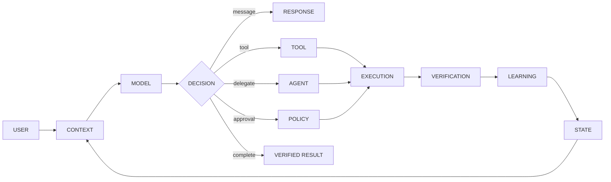

<div align="center">

<a href="https://github.com/FlamuxDev">
  
</a>

<br />


<br /><br />

<a href="https://github.com/FlamuxDev">
  
</a>
<a href="https://github.com/FlamuxDev?tab=repositories">
  
</a>
<a href="mailto:abdfaraj.dev@gmail.com">
  
</a>

</div>

---

<div align="center">

### I DON'T BUILD CHATBOTS.

## I BUILD THE SYSTEM AROUND THE MODEL.

*Clinics booked over WhatsApp · merchants selling in Arabic · answers grounded in private knowledge — live traffic, not demos.*

</div>

<br />

<table align="center">
<tr>
<td align="center" width="25%">

### THINK

Reasoning
Planning
Context
Memory

</td>

<td align="center" width="25%">

### ACT

Tools
APIs
Agents
Automation

</td>

<td align="center" width="25%">

### VERIFY

Evaluation
Traces
Policies
Integrity

</td>

<td align="center" width="25%">

### LEARN

Feedback
History
Signals
Adaptation

</td>
</tr>
</table>

---

# `01` · ENGINEERING

I work on the infrastructure that turns probabilistic models into **reliable software systems**.

My interest is not simply getting a model to produce a good answer.

It is making the entire system around that model:

```text
observable
debuggable
measurable
recoverable
reversible
composable
```

---

# `02` · THE WAY I BUILD

```text
                           ┌──────────────────────┐
                           │        USER          │
                           └──────────┬───────────┘
                                      │
                                      ▼
                           ┌──────────────────────┐
                           │       CONTEXT        │
                           │ memory · state · RAG │
                           └──────────┬───────────┘
                                      │
                                      ▼
                    ┌────────────────────────────────┐
                    │             MODEL              │
                    │                                │
                    │ reasoning · planning · choice │
                    └───────────────┬────────────────┘
                                    │
                    ┌───────────────┼────────────────┐
                    │               │                │
                    ▼               ▼                ▼
                 MEMORY           TOOLS            POLICY
                    │               │                │
                    └───────────────┼────────────────┘
                                    ▼
                           ┌──────────────────────┐
                           │      EXECUTION       │
                           │ jobs · APIs · state  │
                           └──────────┬───────────┘
                                      │
                                      ▼
                           ┌──────────────────────┐
                           │    VERIFICATION      │
                           │ effects ≠ claims     │
                           └──────────┬───────────┘
                                      │
                                      ▼
                           ┌──────────────────────┐
                           │       LEARNING       │
                           │ traces · feedback    │
                           └──────────┬───────────┘
                                      │
                                      └───────────────► NEXT RUN
```

> **The model is a component. The architecture is the product.**

---

# `03` · ENGINEERING PRINCIPLES

<table>
<tr>
<td width="50%" valign="top">

### DETERMINISM AROUND UNCERTAINTY

The model can be probabilistic.

The infrastructure around it should not be.

Tests, state transitions, contracts, retries and failure handling should remain predictable.

</td>

<td width="50%" valign="top">

### EVAL BEFORE OPINION

I prefer traces and measurements over intuition.

```text
golden cases
      ↓
tool-use traces
      ↓
metrics
      ↓
regression
      ↓
ship / reject
```

</td>
</tr>

<tr>
<td width="50%" valign="top">

### FAILURE IS A STATE

Timeouts, provider failures, partial execution and malformed model output are not edge cases.

They are part of the architecture.

</td>

<td width="50%" valign="top">

### EVERYTHING SHOULD BE REVERSIBLE

```text
change
  ↓
snapshot
  ↓
health gate
  ↓
deploy
  ↓
verify
  ↓
rollback
```

A system without a recovery path is unfinished.

</td>
</tr>
</table>

---

# `04` · WHAT I WORK ON

```text
┌──────────────────────────────────────────────────────────┐
│                    AI AGENT SYSTEMS                      │
├──────────────────────────────────────────────────────────┤
│                                                          │
│  Agent Runtime                                           │
│  ├── state machines                                      │
│  ├── execution loops                                     │
│  ├── decision systems                                    │
│  └── long-running tasks                                  │
│                                                          │
│  Context Engineering                                     │
│  ├── memory                                              │
│  ├── retrieval                                           │
│  ├── context assembly                                    │
│  └── user state                                          │
│                                                          │
│  Tool Infrastructure                                     │
│  ├── tool calling                                        │
│  ├── connector lifecycle                                 │
│  ├── permissions                                         │
│  └── external systems                                    │
│                                                          │
│  Reliability                                             │
│  ├── evaluation                                          │
│  ├── observability                                       │
│  ├── retries / backoff                                   │
│  ├── failover                                            │
│  └── integrity checks                                    │
│                                                          │
│  Multi-Agent Systems                                     │
│  ├── specialization                                      │
│  ├── orchestration                                       │
│  ├── delegation                                          │
│  └── agent-to-agent workflows                            │
│                                                          │
└──────────────────────────────────────────────────────────┘
```

---

# `05` · MY DEVELOPMENT LOOP

```text
          ┌─────────────┐
          │   RESEARCH  │
          └──────┬──────┘
                 │
                 ▼
          ┌─────────────┐
          │   SPECIFY   │
          └──────┬──────┘
                 │
                 ▼
          ┌─────────────┐
          │   DESIGN    │
          └──────┬──────┘
                 │
                 ▼
          ┌─────────────┐
          │   BUILD     │
          └──────┬──────┘
                 │
                 ▼
          ┌─────────────┐
          │   TEST      │
          └──────┬──────┘
                 │
                 ▼
          ┌─────────────┐
          │   EVALUATE  │
          └──────┬──────┘
                 │
                 ▼
          ┌─────────────┐
          │   SHIP      │
          └──────┬──────┘
                 │
                 ▼
          ┌─────────────┐
          │   LEARN     │
          └──────┬──────┘
                 │
                 └───────────────► RESEARCH
```

### `BUILD → MEASURE → VERIFY → SHIP → LEARN`

---

# `06` · NOW

```yaml
lines:     onboarding Gulf tenants onto WhatsApp Cloud API · deepening tool-calling in Botify
building:  Luma Architect — first full eleven-agent council run against real providers
studying:  agent evaluation over tool-use traces · sandboxed compute · edge Arabic voice
```

---

# `07` · STACK

<div align="center">


<br /><br />


</div>

<br />

<div align="center">

`TypeScript` · `Python` · `PostgreSQL` · `Redis` · `Prisma`
`Next.js` · `React` · `Docker` · `AWS` · `GitHub Actions`
`LLMs` · `RAG` · `MCP` · `Tool Calling` · `Multi-Agent Systems`

</div>

---

# `08` · AI SYSTEM MAP



---

# `09` · SIGNALS

<div align="center">


</div>

<br />

<div align="center">


</div>

---

# `10` · CONTRIBUTIONS

<div align="center">


<br />


</div>

---

# `11` · PRINCIPLE

<div align="center">

## “An agent you cannot measure is a demo, not a product.”

<br />

`OBSERVE`  `→`  `MEASURE`  `→`  `VERIFY`  `→`  `IMPROVE`

<br /><br />


</div>

---

<div align="center">

### ABDULRAHMAN FARAJ · عبد الرحمن فرج · 2026

*الأنظمة الحيّة لا تنام — the lines never sleep.*

[GitHub](https://github.com/FlamuxDev) ·
[LinkedIn](https://linkedin.com/in/abd-ulrahman-faraj-io) ·
[Website](https://gomawid.com)

</div>
