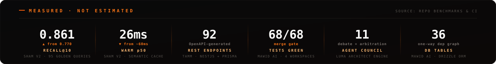
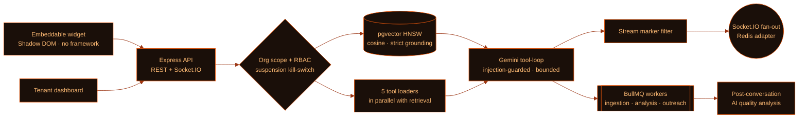
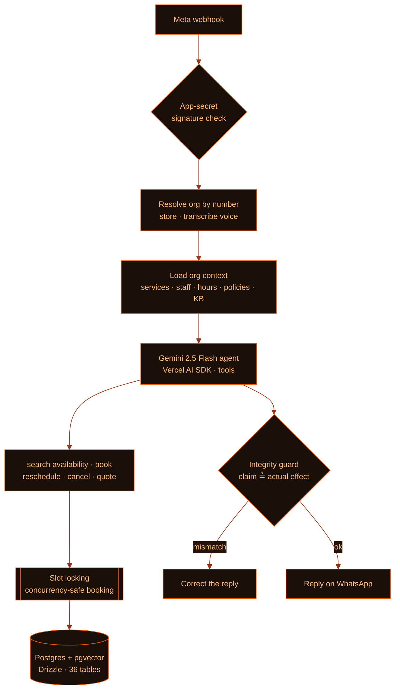
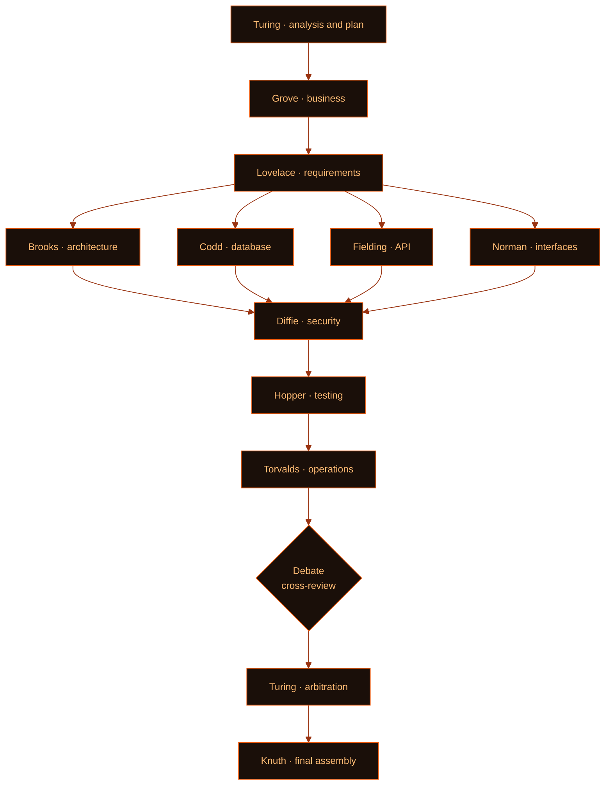

<!-- ═══════════════════════════════════════════════════════════════════════ -->
<!--  ABDULRAHMAN FARAJ · FlamuxDev — AI Agent Engineer                      -->
<!--  Banner, request-path diagram, telemetry band and footer are            -->
<!--  hand-authored animated SVGs in /assets. No template, no render service.-->
<!-- ═══════════════════════════════════════════════════════════════════════ -->



<br/>

I build **AI agents that carry real transactions** — booking a clinic appointment over WhatsApp, selling a merchant's catalog in Arabic, answering from a private knowledge base with tools attached. Multi-tenant, in production, mostly shipped solo. The interesting part is never the prompt; it's everything wrapped around it: retrieval that ranks correctly, tool loops that stay bounded, guards that stop an agent from claiming work it never did, and deploys that can be undone.




## &nbsp;`01`&nbsp;&nbsp;THE REQUEST PATH



Every stage below is code I own in a running system — not a reference architecture.

| # | Stage | What it actually means in my systems |
|:--|:--|:--|
| `01` | **Ingress** | Meta webhook → HMAC signature verification → debounce + idempotency key, so a redelivered message never double-books a slot |
| `02` | **Guard** | Prompt-injection corpus run as a quality gate · per-agent origin allowlists (a state-changing request with no `Origin` is rejected) · tool output wrapped in trust guards before it re-enters the prompt |
| `03` | **Retrieve** | pgvector HNSW cosine **in parallel with** FTS (SQLite FTS5 trigram over normalised Arabic), fused by **RRF** · embeddings refreshed differentially by content hash · two-layer + semantic cache |
| `04` | **Reason** | Bounded Gemini tool-loop, three-layer context manager, per-run token budgets, and a no-LLM fallback path that still answers when the model is down |
| `05` | **Act** | Per-agent **MCP** servers (cached clients, encrypted headers) · domain tools (availability, booking, catalog, pricing) · connectors (Odoo, Dynatrace, Splunk) · automatic provider failover |
| `06` | **Verify** | A server-side **integrity guard**: the agent cannot *claim* an action it did not actually perform. Structural validators reject malformed sections and re-prompt correctively |
| `07` | **Stream** | Socket.IO fan-out over a Redis adapter (cluster-safe) and Postgres `NOTIFY` for live agent progress in the UI |

> [!NOTE]
> Most of the repositories behind this page are **private client/product code**. What is public here is the architecture, the measurements, and the engineering practice — not the source.


## &nbsp;`02`&nbsp;&nbsp;SYSTEMS

| System | What it is | Surface | State |
|:--|:--|:--|:--|
| **Botify + Campify** | Multi-tenant AI agent & customer-engagement platform: RAG over private knowledge, MCP tool-calling, voice, live human handoff, campaign automation | 7-package monorepo · widget · 2 dashboards | `PRODUCTION` |
| **Mawid AI** <sub>موعد</sub> | WhatsApp booking agent for Gulf clinics, salons and workshops — books, reschedules, cancels and reminds, in Arabic and English | `gomawid.com` | `PRODUCTION` |
| **Sham v2** <sub>شمسي</sub> | Arabic educational discovery agent — schools, teachers, events across Jordan, over chat, WhatsApp and voice | API · WhatsApp · voice · MCP | `PRODUCTION` |
| **Luma Architect** | An orchestration engine where **11 specialised agents** turn a plain-language idea into a full engineering blueprint — with a debate round and an arbitration agent | Worker + web | `IN BUILD` |
| **Tamm** <sub>تمّ</sub> | WhatsApp commerce for GCC merchants — an Arabic sales agent on top of a multi-tenant commerce engine | NestJS API · Next.js web | `IN BUILD` |
| **Ray** | Cross-platform desktop agent — multimodal chat, workspace files, ~85 skills, MCP connectors, cron routines, artifacts canvas | Tauri desktop (Linux/Windows) | `PRE-MVP` |

<br/>

<details>
<summary><b>&nbsp;⟩&nbsp; Botify — the hot path, and what makes it survive contact with tenants</b></summary>

<br/>



- **Multi-tenancy is the schema, not a filter** — `Organization` is the tenant root, every query is org-scoped, RBAC with string permissions, a separate platform-admin identity, and an org suspension kill-switch.
- **Knowledge ingestion** — PDF/DOCX/HTML/crawler → chunking → batched Gemini embeddings → HNSW index, with strict-grounding mode and knowledge-conflict detection.
- **Security posture** — AES-256-GCM for tenant secrets at rest, HMAC-signed private media URLs, Redis-backed rate limits, sanitised widget markdown.
- **Deploys that can be undone** — a migration guard that refuses diffs containing `DROP`, a pre-deploy `pg_dump` snapshot, migration + client regeneration on the server, then a `/api/ready` health gate with a documented rollback.

</details>

<details>
<summary><b>&nbsp;⟩&nbsp; Mawid AI — an agent that is allowed to touch the calendar</b></summary>

<br/>



- **The dependency graph is enforced by tooling.** Four workspaces — `core → backend → ai → web`, one direction only. A `backend → ai` import is an **ESLint error**, not a code-review argument. That is what let the frontend, backend and AI tracks move without breaking each other.
- **`core` is a pure leaf** — date/timezone/scheduling/rules logic with no I/O, which is why the booking rules are actually testable.
- **The box never builds.** CI builds the Docker image and pushes it to GHCR; the server only pulls and restarts. Rollback is re-deploying a known-good SHA.
- Baseline that must stay green before merge: `tsc` clean · **68/68 tests** · production build OK.

</details>

<details>
<summary><b>&nbsp;⟩&nbsp; Sham v2 — the rewrite, and the numbers that justified it</b></summary>

<br/>

Design principle: **model-driven understanding, data-derived vocabulary, truth from SQL.**

| | Previous system | **Sham v2** |
|:--|:--|:--|
| Domain vocabulary | ~400 lines of hard-coded synonyms, types and neighbourhoods | **Live gazetteer** derived from the database at boot and after each sync — a new word in the data works with no code change |
| Query understanding | Rules + regex first, LLM for the rare case | **Structured-output Gemini first** (temp 0, few-shot, enums), version-keyed two-layer cache, **plus a non-LLM fallback that keeps working when the model fails** |
| Search | KNN + FTS + RRF | Same proven core, but understanding and embedding run **in parallel**, with background completion on timeout |
| Stability | A tool error killed the reply | Per-tool and per-call timeouts, exponential backoff, fallback model, circuit breaker, single-flight |

**Measured against the previous live system, not against itself:** recall@10 `0.77 → 0.861` · warm p50 `~60ms → ~26ms` · aggregate accuracy held at `100%` · 98 tests · 95-query golden eval suite.

The rewrite kept the published API contract **byte-for-byte** — web, mobile and the voice agent kept working with zero changes.

</details>

<details>
<summary><b>&nbsp;⟩&nbsp; Luma Architect — eleven agents, a debate round, and an arbiter</b></summary>

<br/>

An idea in plain language goes in; a complete engineering document comes out — requirements, architecture, database, API, interfaces, security, testing, deployment. Eleven specialised agents, each named after a computing pioneer, each with one strict role.



- **The four-way fan-out** (architecture / database / API / interfaces) runs **in parallel** after requirements — the single biggest latency win in the pipeline.
- **Jobs are claimed atomically** with `FOR UPDATE SKIP LOCKED`, so two workers can never run the same blueprint.
- **Every state change is broadcast** — a row in the message log plus Postgres `NOTIFY`, so the user watches the council work live instead of staring at a spinner.
- **Validators before persistence** — per-agent structural validators, a Mermaid gate, a consistency checker, and a corrective re-prompt that feeds the rejection back to the agent as guidance.
- **Cost is a design constraint** — development runs against a mock provider returning fixtures (zero cost, offline); real full-pipeline runs are scheduled and budgeted.

I also lead the AI team building it: four pairs with explicit ownership, a two-review merge gate, and a stated definition of done.

</details>

<details>
<summary><b>&nbsp;⟩&nbsp; Tamm & Ray — commerce agent, and an agent on the desktop</b></summary>

<br/>

**Tamm (تمّ)** — an Arabic sales agent over WhatsApp on top of a multi-tenant commerce engine: browsing, cart, delivery, ordering and *"where is my order?"*. NestJS + Prisma, **92 REST endpoints** generated into an OpenAPI document and a ready Postman collection. The e2e suite boots its own embedded Postgres and runs every case against real HTTP and a real database — it is the merge gate. The agent is exercised through a **scripted fake LLM** so the suite stays deterministic, offline and free; a separate live flag verifies the real Gemini wiring end to end (prompt → function calling → tools → a placed order).

**Ray** — a desktop agent for Linux and Windows: streamed multimodal chat with vision, voice in and out, a workspace file tree with a live FS watcher, an artifacts canvas that live-renders HTML/SVG/Mermaid in a sandbox, ~85 bundled skills, 7 MCP connectors, cron-scheduled routines, a Spotlight-style global launcher, and full Arabic + RTL. Tauri 2 + React 19 over a Python agent core; Windows MSI/NSIS/portable builds packaged in CI.

</details>


## &nbsp;`03`&nbsp;&nbsp;HOW I ENGINEER

<table>
<tr>
<td width="50%" valign="top">

**`Determinism around a non-deterministic core`**

The agent is tested through a scripted fake LLM, so the suite is offline, free and repeatable. A separate opt-in flag exercises the real provider wiring. AI code that can only be tested by talking to a model is AI code that is never tested.

**`Eval before opinion`**

Golden-query suites with `recall@10` and latency tracked against the **previous live baseline** — a rewrite ships when the numbers say so, not when it feels faster.

**`Mock-first, cost-aware`**

Default provider is a mock returning fixtures: zero-cost, offline, no key in anyone's `.env`. Real runs are scheduled, budgeted and logged.

</td>
<td width="50%" valign="top">

**`Architecture enforced by tooling`**

Package boundaries live in `tsconfig` paths and ESLint `no-restricted-imports`. A backward import fails the build instead of starting a debate.

**`Deploys that can be undone`**

Migration guard against destructive diffs · pre-deploy database snapshot · health gate before traffic · images built in CI and *pulled* by the server · rollback is one known-good SHA.

**`Failure is an input, not an incident`**

Per-call timeouts, exponential backoff, circuit breakers, single-flight, provider failover, and a degraded path that still answers when the model is unavailable.

</td>
</tr>
</table>


## &nbsp;`04`&nbsp;&nbsp;STACK

**`AI & AGENTS`**


**`BACKEND & DATA`**


**`FRONTEND & DELIVERY`**


## &nbsp;`05`&nbsp;&nbsp;CURRENTLY

```yaml
shipping:
  - Mawid AI      → onboarding Gulf tenants onto WhatsApp Cloud API
  - Botify        → tool-calling depth: more connectors, tighter grounding
  - Luma Architect→ first full eleven-agent run against real providers

studying:
  - agent evaluation — scoring tool-use traces, not just final answers
  - per-user sandboxed compute (Firecracker · gVisor · E2B)
  - on-device and edge inference for latency-bound Arabic voice

principle: "an agent you cannot measure is a demo, not a product"
```


## &nbsp;`06`&nbsp;&nbsp;CONTACT

<a href="mailto:abdfaraj.dev@gmail.com"></a>
<a href="https://linkedin.com/in/abd-ulrahman-faraj-io"></a>
<a href="https://gomawid.com"></a>
<a href="https://shamsieh.ai"></a>

> [!TIP]
> The fastest way to a useful conversation: send me the problem in one paragraph — the constraint, the traffic, and what "correct" means for you.

<br/>

<div align="center">


</div>

<br/>


