<!-- ═══════════════════════════════════════════════════════════════════════
DIRECTION CONTRACT — "SIGNAL BOX" (assigned #3, seed 20415086)
THESIS: this profile is a signal-box control panel; production agent systems
are railway lines running live traffic. Refuses the black+neon terminal rut.
OWN-WORLD: matte graphite instrument ground (#0C0E11–#17191D), bone track
lines (#E9E4D8), signal lamps (green service / amber preparing / white trial),
engraved brass plates (#B08D57), bilingual EN/AR steel plates, transport
grotesque caps with wide tracking.
STORY: within seconds the visitor reads "engineer of live AI agents", sees
the lines and their statuses, may open the relay room for depth, and leaves
through the brass contact buttons.
FIRST VIEWPORT: nameplate banner (EN/AR + role plate + animated running
lines) → one-sentence intro → illuminated route diagram of one request.
FORM: signal-box interlocking panel; raises — fixed-cell row discipline from
the split-flap board; horizon banding for depth from the cyclorama;
size-carries-volume type hierarchy from the Massin stage page.
FINISH: unreviewed and undocumented is unfinished; this build ends with the
finish review, the verdict, DESIGN.md, and every shipping raster carrying its
provenance. Hand-authored SVGs in /assets — no templates, no render services.
═════════════════════════════════════════════════════════════════════════ -->


<br/>

I run **production AI agents** the way a signalman runs a busy junction — every request routed through guards, retrieval and verification before it moves. Clinics booked over WhatsApp, merchants selling in Arabic, answers grounded in private knowledge: **the traffic below is real**, not demos.






<details>
<summary><b>&nbsp;⟩&nbsp; OPEN THE RELAY ROOM — how the lines stay safe</b></summary>
<br/>

| | |
|:--|:--|
| **Determinism around a non-deterministic core** | Agents are tested through a scripted fake LLM — offline, free, repeatable. A separate opt-in flag exercises the real provider wiring. |
| **Eval before opinion** | Golden-query suites with `recall@10` and latency tracked against the previous live baseline. A rewrite ships when the numbers say so. |
| **Architecture enforced by tooling** | Package boundaries live in `tsconfig` paths and ESLint rules — a backward import fails the build instead of starting a debate. |
| **Deploys that can be undone** | Migration guard against destructive diffs · pre-deploy snapshot · health gate · rollback is one known-good SHA. |
| **Failure is an input** | Per-call timeouts, exponential backoff, circuit breakers, provider failover — and a degraded path that still answers when the model is down. |
| **The agent cannot claim what it did not do** | A server-side integrity guard compares claimed actions against actual effects before a reply leaves the system. |

</details>


**`AI & AGENTS`**


**`BACKEND & DATA`**


**`FRONTEND & DELIVERY`**


```yaml
now:
  lines:     onboarding Gulf tenants onto WhatsApp Cloud API · deepening tool-calling in Botify
  building:  Luma Architect — first full eleven-agent council run against real providers
  studying:  agent evaluation over tool-use traces · sandboxed compute · edge Arabic voice

motto: "an agent you cannot measure is a demo, not a product"
```

<a href="mailto:abdfaraj.dev@gmail.com"></a>
<a href="https://linkedin.com/in/abd-ulrahman-faraj-io"></a>
<a href="https://gomawid.com"></a>
<a href="https://shamsieh.ai"></a>

> [!TIP]
> Fastest way to a useful conversation: send the problem in one paragraph — the constraint, the traffic, and what "correct" means for you.

<div align="center">


</div>

<br/>


