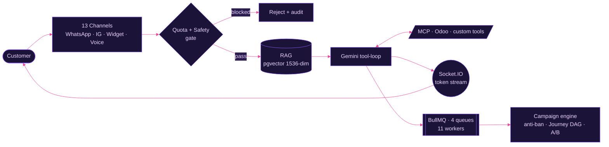
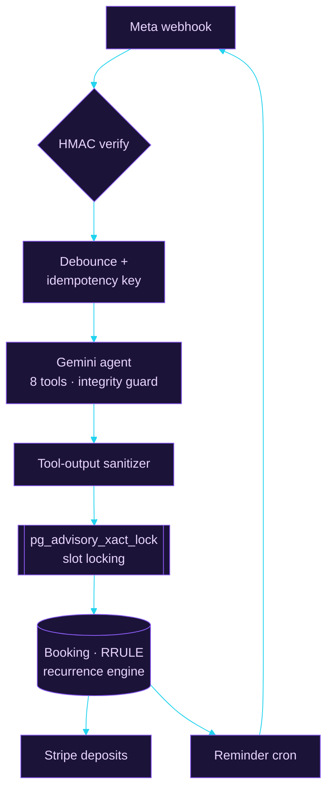
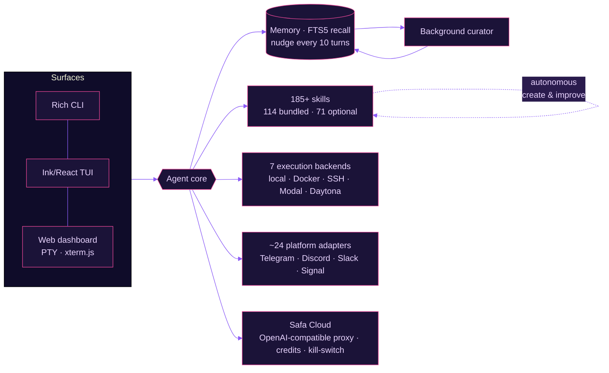
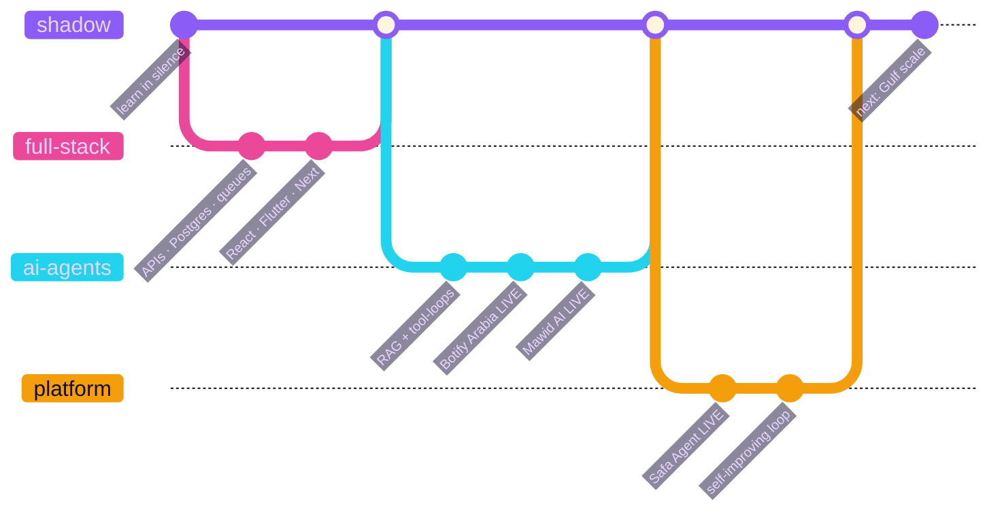

<!-- ══════════════════════════════════════════════════════════════════════ -->
<!--   ✦  ABDULRAHMAN FARAJ ・ FlamuxDev                                    -->
<!--   Every banner, divider, terminal, radar & wave below is a hand-built  -->
<!--   animated SVG in /assets — no capsule-render, no rented templates.    -->
<!-- ══════════════════════════════════════════════════════════════════════ -->

<div align="center">



<br/>


</div>

> [!IMPORTANT]
> **Not a portfolio of demos.** Three multi-tenant AI products in production — architected, built, shipped and operated **solo**, from Amman for the Arabic-speaking market.[^1]


<!-- ═══════════════════════════ DOSSIER ═══════════════════════════ -->

<table align="center" width="100%">
<tr>
<td width="52%" valign="top">

### `🗂️` &nbsp;**CONFIDENTIAL DOSSIER**

```
┌──────────────────────────────────────────────┐
│  SUBJECT     :  Abdulrahman Faraj  (Abd)     │
│  ORIGIN      :  Amman, Jordan 🇯🇴            │
│  ROLE        :  Full-Stack & AI Engineer     │
│  SPECIALTY   :  AI Agents · Multi-Tenant SaaS│
│  SHIPPED     :  3 live AI products, solo     │
│  THREAT LVL  :  ██████████  LEGENDARY        │
│  STATUS      :  [ ACTIVE ・ BUILDING ]        │
└──────────────────────────────────────────────┘
```

> *"People who reveal their full potential are never the ones who win.*
> *True strength lies in knowing when not to act."*

**Operating principles**

- 🧠 &nbsp;Reads the whole system before touching a line
- ♟️ &nbsp;Treats every product like a chess match — three moves ahead
- 🌙 &nbsp;Ships production-grade systems in the silence of night
- 🎯 &nbsp;Owns the full stack: `DB → API → AI pipeline → frontend → DevOps`

</td>
<td width="48%" valign="top" align="center">



</td>
</tr>
</table>


<!-- ═══════════════════════════ ARSENAL ═══════════════════════════ -->

<div align="center">

## `🗡️` &nbsp;**ARSENAL ・ 武器庫**

<i>Every tool mastered quietly. Nothing left to chance.</i>

</div>

<table align="center" width="100%">
<tr>
<td width="46%" valign="middle" align="center">



</td>
<td width="54%" valign="middle">

**`⚡ LANGUAGES`**


**`🎨 FRONTEND`**


**`⚙️ BACKEND`**


**`☁️ CLOUD & DATA`**


</td>
</tr>
</table>

<div align="center">

**`🤖 THE REAL SPECIALTY — AI & AGENT ENGINEERING`**


<br/>


<br/>


</div>


<!-- ═══════════════════════ FLAGSHIP OPERATIONS ═══════════════════════ -->

<div align="center">

## `⚔️` &nbsp;**FLAGSHIP OPERATIONS ・ 主力作戦**

<i>Not prototypes. Live, multi-tenant, production systems — built and shipped solo.</i>
<br/><i>Open a file to read the internals. 👇</i>

</div>

### `🟣` **Botify Arabia** &nbsp;&nbsp; `shamsieh.ai`

Enterprise-grade **multi-tenant AI chat & voice SaaS** — businesses build, configure and deploy AI agents through an embeddable widget or omnichannel integrations.

<details>
<summary><b>&nbsp;⟩ &nbsp;Open the architecture</b></summary>

<br/>



```
◆ Turborepo monorepo — 5 packages (API · dashboard · admin · widget · shared)
◆ Omnichannel — 13 self-registering providers · Meta Embedded Signup · per-org AES-GCM tokens
◆ Campaign engine — anti-ban gate · Journey DAG automation · A/B testing · per-org DKIM
◆ Enterprise monitoring — Dynatrace triage + Splunk SOC command center (SPL queries)
◆ Scale — ~227 REST endpoints · ~29 Prisma models · 11 workers · EC2 + Nginx + PM2
```

</details>

<sub>`TypeScript` `Express` `Prisma` `PostgreSQL + pgvector` `Redis` `BullMQ` `React` `Socket.IO` `LangChain` `Gemini` `ElevenLabs`</sub>

<br/>

### `🟣` **Mawid AI** &nbsp;<sub>(موعد)</sub>&nbsp; 

B2B **WhatsApp appointment-booking SaaS** for Gulf businesses (clinics, salons, gyms) — tenants connect their number and an AI agent handles inquiries, booking, rescheduling and cancellations in Arabic and English.

<details>
<summary><b>&nbsp;⟩ &nbsp;Open the architecture</b></summary>

<br/>



```
◆ Strict layered architecture — kernel → domain → infrastructure → application
◆ Concurrency — advisory-lock slot reservation kills double-booking races
◆ Onboarding — 7-step wizard · 22 industry presets · full dark mode
◆ Ops — Docker + Caddy on EC2 · dynamic pricing · bilingual AR/EN agent
```

</details>

<sub>`Next.js 16` `React 19` `Drizzle ORM` `PostgreSQL + pgvector` `Vercel AI SDK v6` `Tailwind v4` `shadcn/ui` `WhatsApp Cloud API` `Stripe`</sub>

<br/>

### `🟣` **Safa Agent** &nbsp;<sub>(mythos)</sub>&nbsp; &nbsp;<sub>— largest in the portfolio</sub>

**Self-improving AI agent platform** — a productized fork of Nous Research's Hermes Agent, extended with a full cloud SaaS layer.

<details>
<summary><b>&nbsp;⟩ &nbsp;Open the architecture</b></summary>

<br/>



```
◆ Learning loop — memory/skill nudges every 10 turns · background curator · FTS5 recall
◆ Hardened — PathGuard + Docker egress allowlist · Go WebView2 installer
◆ Quality gate — 976-file hermetic pytest suite
◆ Billing — Stripe · quota/kill-switch · device-link auth
```

</details>

<sub>`Python ≥3.11` `FastAPI` `React` `TypeScript` `SQLite` `PostgreSQL (Neon/Supabase)` `Docker` `Go`</sub>


<!-- ═══════════════════════════ TRAJECTORY ═══════════════════════════ -->

<div align="center">

## `🧭` &nbsp;**TRAJECTORY ・ 軌跡**

</div>




<!-- ═══════════════════════════ THE CODE ═══════════════════════════ -->

<div align="center">

## `🎭` &nbsp;**THE CODE OF THE SHADOW GENIUS**

</div>

```python
class HiddenGenius:
    """
    The strongest player is the one who hides their strength.
    Reveal only what the situation demands — no more, no less.
    """

    def __init__(self):
        self.intelligence   = float('inf')
        self.visible_effort = 0.15   # show just enough to blend in
        self.real_output    = 1.00   # deliver beyond expectations
        self.principles     = [
            "observe_before_acting",
            "master_every_tool_quietly",
            "never_waste_a_move",
            "let_the_work_speak",
        ]

    def solve(self, problem):
        # Others see the solution. They never see the thinking.
        while problem.exists():
            self.analyze(problem)
            self.plan_three_moves_ahead()
            self.execute(precision=True, noise=False)
        return "Done. Moving to the next one."

    def __repr__(self):
        return "A developer you'll only notice once it's too late."
```

<div align="center">

<sub>the same idea, with the noise factored out:</sub>

</div>

$$
\textbf{Impact} \;=\; \sum_{i=1}^{n} \Big( \text{Depth}_i \times \text{Ownership}_i \Big) \;-\; \lambda \cdot \text{Noise}, \qquad \lambda \to \infty
$$


<!-- ═══════════════════════════ BATTLE RECORD ═══════════════════════════ -->

<div align="center">

## `📊` &nbsp;**BATTLE RECORD ・ 戦績**

<br/>


<br/><br/>


</div>


<!-- ═══════════════════════ CURRENT OPERATIONS ═══════════════════════ -->

<div align="center">

## `🎯` &nbsp;**CURRENT OPERATIONS ・ 現在の作戦**

</div>

| ` ` | Active mission | Progress |
|:--|:--|:--|
| `🔴` | Scaling **Botify Arabia** for the Saudi / Gulf B2B market | `███████████████░░░░░` `74%` |
| `🔴` | Self-improving multi-agent systems — **Safa / mythos** | `██████████████████░░` `88%` |
| `🟣` | Per-user sandboxed compute — Firecracker · gVisor · E2B | `████████░░░░░░░░░░░░` `41%` |
| `🟣` | Edge inference & on-device LLMs | `█████░░░░░░░░░░░░░░░` `26%` |
| `🟢` | The art of saying nothing while knowing everything | `████████████████████` `∞` |

```yaml
philosophy:
  quote:    "I don't compete with others. I compete with who I was yesterday."
  standard: "اسطوري — or it doesn't ship"
  goal:     "Build things that outlive the noise"
```

> [!TIP]
> Best way to reach me: a concrete problem, in one paragraph. <kbd>E</kbd> for email below — response probability: calculated.


<!-- ═══════════════════ WORDS FROM THE MASTERMINDS ═══════════════════ -->

<div align="center">

## `🌙` &nbsp;**WORDS FROM THE MASTERMINDS**

<table>
<tr>
<td align="center" width="50%">

> *"I don't really care about winning or losing. As long as I don't lose sight of myself, that's enough."*

**— Kiyotaka Ayanokoji**<br/>
<sub>Classroom of the Elite</sub>

</td>
<td align="center" width="50%">

> *"Hard work betrays none, but dreams betray many."*

**— Hachiman Hikigaya**<br/>
<sub>Oregairu</sub>

</td>
</tr>
</table>

</div>


<!-- ═══════════════════════════ SNAKE ═══════════════════════════ -->

<div align="center">

## `🐍` &nbsp;**CONTRIBUTION HUNT**


</div>


<!-- ═══════════════════════════ CONTACT ═══════════════════════════ -->

<div align="center">

## `📡` &nbsp;**ESTABLISH CONTACT ・ 連絡**

<i>Message received. Response probability: calculated.</i>

<br/>

<a href="https://github.com/FlamuxDev"></a>
<a href="https://linkedin.com/in/abd-ulrahman-faraj-io"></a>
<a href="mailto:abdfaraj.dev@gmail.com"></a>
<a href="https://shamsieh.ai"></a>

<br/><br/>


<br/><br/>

### *"The true elite don't need to prove anything. Their work does it for them."*

<br/>


</div>

[^1]: Every animated banner, divider, boot terminal, skill radar and wave footer on this page is a hand-authored SVG living in [`/assets`](assets) — pure SMIL, no scripts, no third-party render service. Steal the technique, not the file.
